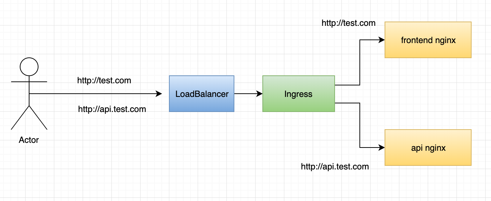
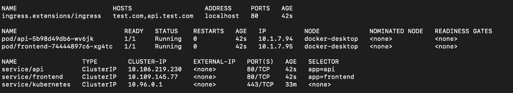

> This is a fork of https://codeburst.io/replicate-kubernetes-ingress-locally-with-docker-compose-2872e650af6b

> /!\ I am not the author, credit to Kim Wuestkamp


# Replicate Kubernetes Ingress locally with Docker Compose

With this guide we will setup a simple Kubernetes Ingress scenario and then simulate this using Docker Compose for local development.

## Article Series

Part1: this article

Part2: [setup HTTPS](article-part-2.md).

## Kubernetes Ingress scenario

Ingress is a resource you install in your cluster which can redirect requests to different services based on http requests.

Simplified said it’s an already configured Nginx instance (if using the Nginx Ingress) which does proxy-passes. Using it you can create infrastructure like this:

|  |
|:--:|
| <b> Request gets redirected to different services depending on domain name </b> |


In our scenario we simply use default Nginx images for frontend and api. The idea would be that the frontend Nginx is a webinterface which would send requests to the api Nginx.

## Github repo

You can find the complete project here, just checkout branch part1

https://github.com/wuestkamp/kubernetes-ingress-docker-compose

## Kubernetes Config for that scenario

To setup the scenario above we need this configuration:

ingress.yaml

````
apiVersion: networking.k8s.io/v1beta1
kind: Ingress
metadata:
  name: ingress
  annotations:
      kubernetes.io/ingress.class: nginx
spec:
  rules:
  - host: test.com
    http:
      paths:
      - backend:
          serviceName: frontend
          servicePort: 80
  - host: api.test.com
    http:
      paths:
      - backend:
          serviceName: api
          servicePort: 80
````

api_service.yaml

````
apiVersion: v1
kind: Service
metadata:
  labels:
    app: api
  name: api
spec:
  ports:
  - name: 80-80
    port: 80
    protocol: TCP
    targetPort: 80
  selector:
    app: api
  type: ClusterIP
````

api_deployment.yaml

````
apiVersion: apps/v1
kind: Deployment
metadata:
  name: api
spec:
  replicas: 1
  selector:
    matchLabels:
      app: api
  template:
    metadata:
      labels:
        app: api
    spec:
      containers:
      - image: nginx:1.16
        name: api
````

frontend_service.yaml

````
apiVersion: v1
kind: Service
metadata:
  name: frontend
spec:
  ports:
  - name: 80-80
    port: 80
    protocol: TCP
    targetPort: 80
  selector:
    app: frontend
  type: ClusterIP
````

frontend_deployment.yaml

````
apiVersion: apps/v1
kind: Deployment
metadata:
  name: frontend
spec:
  replicas: 1
  selector:
    matchLabels:
      app: frontend
  template:
    metadata:
      labels:
        app: frontend
    spec:
      containers:
      - image: nginx:1.16
        name: frontend
````

Also we need to create the Nginx Ingress in our cluster:

````
kubectl apply -f https://raw.githubusercontent.com/kubernetes/ingress-nginx/nginx-0.24.1/deploy/mandatory.yamlkubectl apply -f https://raw.githubusercontent.com/kubernetes/ingress-nginx/nginx-0.24.1/deploy/provider/cloud-generic.yamlkubectl get svc --namespace=ingress-nginx # to see your LoadBalancer
````

Once we apply all this we should see something like:

|  |
|:--:|
| <b> Notice the ingress ADDRESS says localhost because I use Docker For Desktop, it should be your LoadBalancer  </b> |


http://test.com will point to the **frontend** service and http://api.test.com to the **api** service (if you have correct /etc/hosts entries or even correct domain name entries).

## Replicate this with Docker Compose

In my opinion sadly Kubernetes isn’t ready for local development yet, we have to get there though! Main reason are various performance issues you can find on various Github issues, if you want to get down that rabbit hole! **So having docker compose running locally is still a good way to go.**

### /etc/hosts entries

You should setup some hosts entries to your domains:

127.0.0.1 test.com api.test.com

### Docker-Compose file

We will use [jwilder/nginx-proxy](https://github.com/nginx-proxy/nginx-proxy) for this which is pretty amazing. It creates automatically proxy-pass Nginx directives for every Docker Compose service which has an environment variable `VIRTUAL_HOST` defined, pretty similar to a Kubernetes Ingress.

docker-compose.yaml

````
version: '3.4'

services:
  ingress:
    image: jwilder/nginx-proxy
    ports:
      - "80:80"
    volumes:
      - /var/run/docker.sock:/tmp/docker.sock:ro

  frontend:
    image: nginx:1.16
    ports:
      - "81:80"
    environment:
      - VIRTUAL_HOST=test.com

  api:
    image: nginx:1.16
    ports:
      - "82:80"
    environment:
      - VIRTUAL_HOST=api.test.com
````

> In your project the services frontend and api would probably refer to a Dockerfile and build that context instead of using existing pubic images. We do this here like this for simplicity.

This config will make the frontend Nginx available at http://localhost:81 and the api Nginx at http://localhost:82, just as Docker Compose normally would.

Thanks to the ingress service and jwilder/nginx-proxy we can also reach http://test.com and http://api.test.com, if we have setup the correct /etc/hosts entries.

## The end

Now we can simulate a Kubernetes Ingress using Docker Compose for local development.

One thing we would’ve to look into is correct CORS configuration so that requests from http://test.com could be send to http://api.test.com. But this might be something for another time.

Let me know if you do it differently or have other suggestions!