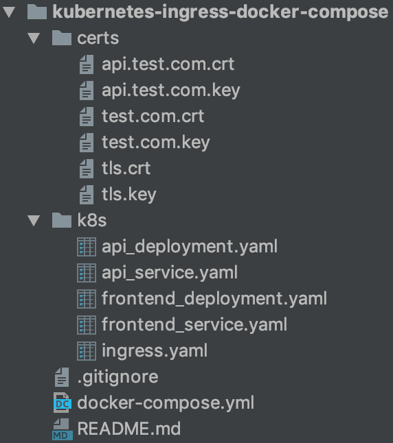

> This is a fork of https://codeburst.io/replicate-kubernetes-ingress-locally-with-docker-compose-2872e650af6b

> /!\ I am not the author, credit to Kim Wuestkamp


# Part 2 - TLS Replicate Kubernetes Ingress locally with Docker Compose

Today we will continue Part 1 and configure HTTPS for a Kubernetes Ingress as well as a Docker Compose replica used for local development.

## Article Series

- Part1: [Replicate Kubernetes Ingress locally with Docker Compose](article-part-1.md)
- Part2: this article

## Kubernetes Ingress scenario

Requests reach Ingress using HTTPS which then redirects to internal ClusterIP services using http

This extends Part 1 so make sure to read this first.

## Github repo

You can find the complete project here, just checkout branch part2

https://github.com/wuestkamp/kubernetes-ingress-docker-compose

## Extend Kubernetes Config for HTTPS

### Generate self signed certificates

First lets create self signed https certificates, I’ll create those in a certs directory which I do commit into the repo, **which you shouldn’t do if it’s a real project**!

````
sudo openssl req -x509 -nodes -days 9999 -newkey rsa:2048 -keyout certs/test.key -out certs/test.crt
````

### Create a Kubernetes secret from these certificates:

````
kubectl create secret tls ingress-cert --key certs/tls.key --cert certs/tls.crt -o yaml --dry-run > k8s/ingress_secret.yaml
````

I also commit this secret into the repo, **which we won’t do in production O:)
Make Ingress use TLS**

We change the ingress.yaml to this:

````
apiVersion: networking.k8s.io/v1beta1
kind: Ingress
metadata:
  name: ingress
  annotations:
      kubernetes.io/ingress.class: nginx
spec:
  tls: # <-- ADD 
  - hosts:
    - test.com
    - api.test.com
    secretName: nginx-cert  <-- END ADD
  rules:
  - host: test.com
    http:
      paths:
      - backend:
          serviceName: frontend
          servicePort: 80
  - host: api.test.com
    http:
      paths:
      - backend:
          serviceName: api
          servicePort: 80
````
> We assume here that the ssl certificate is a wildcat one for *.test.com, else you need to have multiple secrets.

After running `kubectl apply -f k8s` we should be able to reach https://test.com and https://api.test.com.


|  |
|:--:|
| <b> we reach HTTPS. It’s just labelled as Not Secure because of the self signed certificate  </b> |


So the Kubernetes Ingress is done.

## Extend Docker Compose config for HTTPS

Now we adjust the `docker-compose.yaml`, with just two lines:

````
version: '3.4'

services:
  ingress:
    image: jwilder/nginx-proxy
    ports:
      - "80:80"
      - "443:443" # <- Line added 
    volumes:
      - /var/run/docker.sock:/tmp/docker.sock:ro
      - ./certs:/etc/nginx/certs # <- Line added 

  frontend:
    image: nginx:1.16
    ports:
      - "81:80"
    environment:
      - VIRTUAL_HOST=test.com

  api:
    image: nginx:1.16
    ports:
      - "82:80"
    environment:
      - VIRTUAL_HOST=api.test.com
````

What the jwilder/nginx-proxy image needs it that the certificates are named like the `VIRTUAL_HOST` entries. So here we should have:

|  |
|:--:|
| <b> I used the tls.crt and tls.key for the Kubernetes Ingress and the other ones for the Docker Compose Ingress </b> |


## I think we are done here

That’s it, now we can test the interaction of different domain names and their services also using https locally. Using Kubernetes Ingress for TLS termination is pretty amazing, especially if you have multiple services which should be behind https. This way you have a single place for TLS configuration.

Let me know if you do it differently or have other suggestions!
