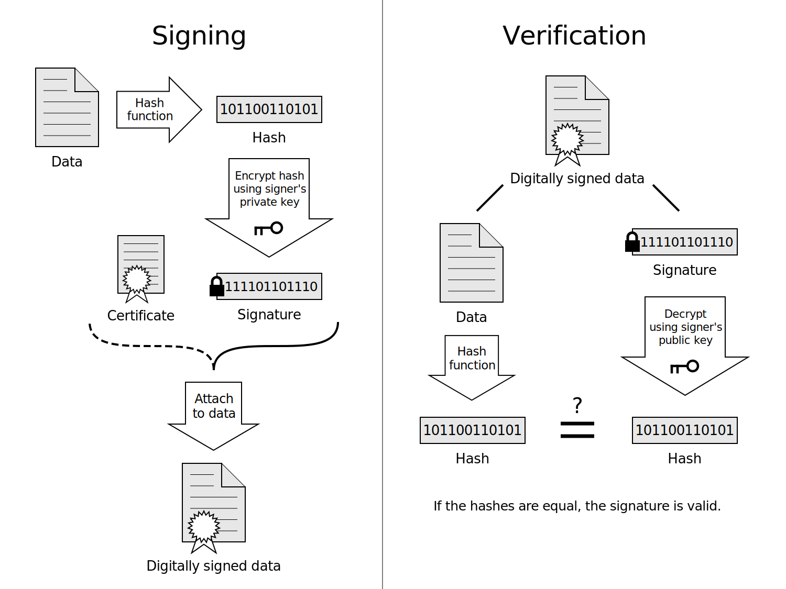

# Leanring SSL TLS 

This complement on top of [TLS certificate](../tls-certificate.md).

## Part 1

### PKI hierarchy

https://www.linkedin.com/learning/learning-ssl-tls/pki-hierarchy?autoSkip=true&autoplay=true&resume=false&u=75507506

#### PKI components

- Certificate Authority (CA): issues, renews, revokes certificate, maintain CRL, offline
- Rgistration Authority (RA): subordinate CA, used to manage certificatees
- Certificate Revocation List (CRL) or Online Certificate Status Protocol (OCSP): verifiy certificate validity using s/n
- Ceritifcate template: Blueprint used when using certificate
- Certificate: contains template name, signature of CA, expiry info, pub/priv key

We can have Single-Tier PKI hierarchy (top is CA) or multi-tier PKI hierarchy (we have RA).
Multi-tier avoids to have CA online.

#### PKI cert

We should not say SSL or TLS vcert but PKI cert that can be used by SSL/TLS.
We can say PKI, digital cert, security or x509.

#### CRL 

Certificate revocation: 
- CRL (download full list maintained by CA) or OCSP (query soft component, query for a specific certificate).
- OCSP has OCSP stapling, certificate owner (webserver) check is own status.
Browser will receive OCSP stapling. Avoid client to query

#### Public Key Pinning (PKP)

There is also concept of public key pinning (similar to known host)

https://www.linkedin.com/learning/learning-ssl-tls/certificate-lifecycle-management?autoSkip=true&autoplay=true&resume=false&u=75507506


CSR is in PKCS#10 format

See also [multidomain](../multidomain.md).

<!-- Learning part 1 ok -->

## Part 2: PKI CA implementation

We will install a PKI Certificate Authority (CA) on Microsoft Windows Server, Linux.
This root CA relies on Root certificate.

See [cert hierarchy](../tls-certificate.md#more-details-on-sections-and-certificate-hierarchy).


[For all cases below we setup our own CA (not a well know CA like Digicert or Comodo) so it means client needs to trust this private CA.](../tls-certificate.md#private-ca).

Whether we have a private or public CA. CA are self-signed.

See https://docs.oracle.com/cd/E19509-01/820-3503/ggbgc/index.html

We will also see how to setup a subordinate CA (in AWS) of a root CA (Windows).


### MS AD CS certificate authority (Step 1)

We install a PKI Certificate Authority (CA) on Microsoft Windows Server.
CA has common name (FakeDomain1 in video).

From there certifcate requestor can request certificate signed by this authority.

### MS AD CS certificate template (Step 2)

We can have template for certificate request.
And can customize it.
We need to issue the certificate template to be available for use.

From this template we can create certificate

### Linux OpenSSL PKI environment

Similalrly we can also have a CA authority in linux.
We start by genrating private key for the CA (on windows we had same step or could reuse exisiting one)

````
openssl genrsa -aes256 -out CAprivate.key 2048
````

Then we generate the root Certificate with that authority private key.

````
openssl req -new -x509 -key CAprivate.key -sha256 -day 365 -out FakeDomain2CA.pem 
````

This require CA private key passphrase

More details [here, create-root-ca-done-once](./self-signed-certificate-with-custom-ca.md#create-root-ca-done-once)

### Configure AWS subordinate CA

https://www.linkedin.com/learning/learning-ssl-tls/configure-an-aws-certificate-manager-subordinate-ca?autoSkip=true&autoplay=true&resume=false&u=75507506

We will define a subordinate CA of private CA we defined in [MS AD CS certificate authority (Step 1)](#ms-ad-cs-certificate-authority-step-1).

 - Go to `AWS certificate manager` > `private certificate CA` where we a single option to define a subordinate CA. 
- AWS provides a CSR for the CA. 
- In Windows Server certificate management (certsrv) web UI, go to: > `Request a certificate` > `advanced` > `submit a certificate request`
Using subordinate CA template.
- Copy the CSR provided by AWS
- And we can download the certificate (`.cer` file) and the chain.
Certificate is digitally signed by the CA.
- Then in AWS we can import the certificate and we need to import the chain.
- The subordinate CA is then active.
- In windows CA, in issued certifcate we can see the certicate we issued for the subordinate CA.

==> This solution is hybrid with CA on premise and subordinate in the cloud.

This is compliant with 
See [cert hierarchy](../tls-certificate.md#more-details-on-sections-and-certificate-hierarchy) where here we did not sign a user certificate but a subordinate CA certificate.


## Part 3: PKI certificate acqusition

(user, webserver certificate)

https://www.linkedin.com/learning/learning-ssl-tls/ssl-vs-tls?autoplay=true&resume=false&u=75507506


### SSL vs TLS

- both use PKI certificates
- Used for
    - encryption 
    - digital signature
- SSL is deprecaed, even SSLv3, superseded by TLS (introduced in 1999)
- We can have security protocol downgrade attacks, so disable SSL (Poodle attacks)
- SSL known vulnerability is Heartbleed bug
- We also have SSL VPN
- TLS VPN are different as they use TCP/443 (firewall friendly)
- Security protocol can be configured on client side

#### Acquire a webserver certificate using Microsoft AD CS

**Desktop GUI certsrv**

we can see templates -> custom webserver
Certif template -> rigth click manage and see details.

**Desktop GUI certlm - `manage conmpute certificate` (also avail in win10)** to acquire PKI cert (can be done on any machine who joined domain and not only)

We request new cert from here, we use template `custom web server`
We provide subject name (common name) and SAN (important cf. domain mismatch). Some field can be mandatory and enforced template.
Then click enroll.
At the end FakeDomain CA has issued webserver certificate.

We can also acquire certificate via Web UI (`<cert authority url>/certsrv`) or automation.

It is also store in cert store (certlm).

#### Acquire a **client** certificate using Microsoft AD CS

We configure on server side a template for client certificate as we did [above](#ms-ad-cs-certificate-template-step-2).


**GUI cert srv**

We have a template for client/server authentification (computer template).
Certif template and rigth click manage to see details.
In example they delete the existing computer templat to reset ite and re-create one (new certificate template to issue, computer)

**MMC console (also avaialble in Windows 10)**

- `File > add a new snap in > cert > computer account cert`
- `Certificates > Personal > request new cert > we have computer cert > enroll`
We can see the issued certficate.

We can pay attention to intended purpose which is client/serv auth.

It is also available in Windows 10.
Here we acquire a cert for our machine's user(where MMC is run) from a CA.

<!-- can see well in corp laptop -->

#### Acquire a **webserver** certificate using OpenSSL

For instance to run Apache server.

From [Linux OpenSSL pki env](#linux-openssl-pki-environment) we have :
- CApprivate.key
- FakeDomain2CA.pem

**Step 1**: We will generate pub/priv key pair to be used for that specific certificate we are creating (one for each cert)

````
openssl genrsa -aes255 -out www.fakesitelcal.key 2048
````

This will create `www.fakesitelocal.key`.

**Step 2**: Then we will generate the CSR (Certificate Signing Request)

`````
openssl req -new -key www.faksesitelocal.key -out www.fakesite.local.csr
`````

This requuires passphrase of `www.fakesitelocal.key`.

Extra attributes are also requested.

This will create the CSR `www.fakesite.local.csr` and also `otherinfo.ext`.

In `otherinfo.ext` we have the alt name (filled in CN)

**Step 3**: Then we create the server certificate

````
openssl x509 -req -in wwww.fakesite.local.csr -CA FakeDomain2CA.pem -CAKey CAprivate.key -CAcreateserial -extfile otherinfo.ext -out www.fakesite.local.crt -day 365 -sha256
````

This requires passphrase of `CAPrivate.key`.

Output is `www.fakesite.local.crt`

**Step 4**: Finally we configure Apache we have 

````
<VirtualHost *:443>
    SSLEngine on
    SSLCertificateFile /cert/www.fakesite.local.crt # certificate
    SSLCertificateKeyFile /cert/www.fakesitelocal.key  # private key of specific cert
    SSLCACertificateFile /cert/FakeDomain2CA.pem # root certificate

````

We restart Apache, it requires passphrase (certificate private key)

In browser we can see it is trusted.
Because we import in browser SSLCACertificateFile as again it is our own private CA.

Here certificate is signed with our private CA (not a public CA or public CA delegation).
Note we could also create a webserver certificate which is self-signed (creation would be similar to CA certificate)

See 3 cases here: https://github.com/scoulomb/myDNS/blob/master/2-advanced-bind/5-real-own-dns-application/6-use-linux-nameserver-part-g.md#step-2-configure-the-server-to-use-https


What we described here is fully aligned with [create-root-ca-done-once](./self-signed-certificate-with-custom-ca.md#create-a-certificate-done-for-each-server)


Note that this directive `SSLCACertificateFile` is used for client auth.
Quoting: https://httpd.apache.org/docs/2.4/en/mod/mod_ssl.html
> This directive sets the all-in-one file where you can assemble the Certificates of Certification Authorities (CA) whose clients you deal with. These are used for Client Authentication. Such a file is simply the concatenation of the various PEM-encoded Certificate files, in order of preference. This can be used alternatively and/or additionally to SSLCACertificatePath.

So it means that if we acquire a client certificate like we did in this section with [windows](#acquire-a-client-certificate-using-microsoft-ad-cs),
We would trust client if the the CA (or chain) is included in `SSLCACertificateFile`.

See also here an example of Apache config:
https://github.com/open-denon-heos/remote-control/blob/main/apache-setup/heos.conf


### Acquire a webserver certificate using AWS certificate manager


We will acquire a cert from subordinate C+
A (subordinate of Windows CA) in AWS certtificate manager.

> `certicate amanager` > can see FakeCOSubCA

> `certicate amanager` > `get started` > `Request private certificate` (we already imported) (public would mean it is signed by Amazon public CA) > `Select the sub CA` we created previously> we enter domnain name > `request`

We can see the issued certificate and can export the certificate.


### Link with cert experiements with Python (NodePort) and k8s ingresses

- Self-signed: https://github.com/scoulomb/myDNS/blob/master/2-advanced-bind/5-real-own-dns-application/6-use-linux-nameserver-part-g.md (note key generation `-newkey` in OpenSSL command)
- public (sub)CA:  https://github.com/scoulomb/myDNS/blob/master/2-advanced-bind/5-real-own-dns-application/6-use-linux-nameserver-part-h.md

We could also offload cert in [loab balancer or ESB](../tls-certificate.md#complements).

<!-- ok, links with links cloud/move tls term -->

### Acquire a code signing certificate

They are use to sign digitally software (Authority could be appstore or organization).


**GUI cert srv**

We have a template for client/server authentification. No code sign-in template is issued (not visible)
Certif template and rigth click manage to see details. We will modify existing code sign-in template, make change and call it `custom sign in`.
The rigth clik on cert template and issue the template.

**GUI certlm - `manage conmpute certificate` (also avail in win10)** to 

In `Personal > Certificates > request`, we can see custom code sign in  `X` status, because it can only be issue to a user and not an app.
It is not a computer type cert but user cert.

**MMC console (also avaialble in Windows 10)**

- `File > add a new snap in > cert > My user account cert`
We can see cert for this user
- `Certificates > Personal > request new cert > we have custom code sign in cert > add more info > enroll`
We can see the issued certficate.

We can pay attention to intended purpose which is code sign-in.

It is also available in Windows 10.
Here we acquire a cert for our machine's user (where MMC is run) from a CA.

We verify signature using public  key.

## Part 4: PKI certificate usage

<!-- all above is clear and OK -->

### Hashing and digital signature

#### Hashing

- Hashing does not necessarilty a PKI certificate but can be
- Used to verify integrity of network messages, files and machine boot-up settings
- Does not provide data confidentiality (!= encryption)
- Used with SSL and TLS
- Use a one-way algorithm that results in a unique value on data which is  hashed (hash, message digest).
For example in filesystem, we compute hash and save it. Later when we recompute the hash, If message/file has a different hash we know something was changed. It could have been modified by an unauthorized party.
- Hashing algo are SHA-(1,2,3), MD-5, RIPEMD

#### Digital signature

- Used to provide
    - data authentification (trust who send message -> signed with private key),
    - integrity (data non tampered by 3rd party)
    - and non repudation
- Do not provide data condidentiality
- Used with SSL and TLS (see [TLS cert](../tls-certificate.md#man-in-the-middle-attach-and-need-of-a-ca)), application script and [device drivers](#acquire-a-code-signing-certificate).

Digital signature relies on [Hashing](#hashing) and PKI certificate (wrongly called SSL, TLS certificate)

From https://security.stackexchange.com/questions/67512/what-role-do-hashes-play-in-tls-ssl-certificate-validation

> For example, with RSA signatures the signature can be thought of as a hash of the data being signed, "encrypted" with the signer's private key:

.

Example of mail signature (different from encryption)
- We generate hash value of the message content 
- We encrpt has with sender private key
- Recipient will verify signature with public key

(asymetric) Encryption of message will require recipient public key.

In TLS/SSL we also use PKI cert for [signature and encryption], see [TLS cert](../tls-certificate.md#man-in-the-middle-attach-and-need-of-a-ca).
So both are used in section [below](#website-with-pki-cert).

Note PKI certificate is [itself signed](../tls-certificate.md#more-details-on-sections-and-certificate-hierarchy)

### Configure a website with a certificate

In regedit we can disable use of SSL.
Can also do this in IE internet option.
We need a PKI cert in the host, run `certmgr`.
We got it from [acquire-a-webserver-certificate-using-microsoft-ad-cs](#acquire-a-webserver-certificate-using-microsoft-ad-cs).
<!-- case where ca same place as webserver --> 

If we go to  `https://IIS-url`, page can not be displayed because no bindings defined for port 443.
We set it in IIS and need to select SSL cert.
When refeshing page worknig and see cert in pad lock.

### Configure a webbrowser with a (client) certificate

In IIS adminstrative tool.
We can see we have a server cert from [previous section](#configure-a-website-with-a-certificate).
Any client can access the server and we want to restrict that.
We can require a SSL certificate for client

When exchanging server, server will exchange list of accepted CA (or chain) and client will select a certificate (among the one it has) thay matches what is trustd by server if any.

Thus on client side we start `MMC`, add snapping, add user certificate.
We will add certificate that can be used for client authentification.
We will request a new client certificate via `MMC` (possible here as machine where web client is also machine where we have the CA server) or `certsrv`webpage and click enroll. This certificate is issued by by CA FakeDomain1.
This what we did in [acquire client cert section](#acquire-a-client-certificate-using-microsoft-ad-cs).

This CA is trusted by server.

Indeed here we are in the case where machine is the same for
- web client
- web server
- certificate authority FakeDomain1

And where same CA FakeDomain1 delivers
- server certificate 
    - So client trusts FakeDomain1 private CA (otherwise need to import private CA in browser, as not public CA)
- client certificate
    - So server trust certificate delivered by FakeDomain1 private CA (otherwise need to configure server to trust this CA)


Go to brower, go to `tools > internet options> local intranet`, we will enable to prompt for client cert even if have 1 match client cert for the example.

Go to page, we are prompt client certificate,  we are able to access website.


This exactly what we have seen in [OpenSSL section](#acquire-a-webserver-certificate-using-openssl) with the directive `SSLCACertificateFile`.
<!-- and same CA for client and server -->

This is known as mTLS.

### Configure a code-signing cert with Microsft Powershell


<!-- clear ok, all above ok yes including last notes OK re-cf-10/06PM-->

- Use code sign-in cert to sign software, script
- Establish trust, could allow enterprise machine to only script which are signed/

- `MMC`, add remove snap in, snap in to show user cert, can see personal cert
-`Certificate authority` > `custom code sign in template`.
We can see template and customize it. This is what we had [created](#configure-a-code-signing-cert-with-microsft-powershell) 
- We can then acquire a code signing certtidcate via `certsrv` using the template as previously done in section [acquire a code signing certificate](#acquire-a-code-signing-certificate).
- In `MMC`, a code signing certificate is now availalble.
- In `MMC` console note we have a trusted publisher section it is empty
- We have a powershell script `Test.ps1` we want to sign
- And here is `Sign_Sscript.ps`

````
$cert=(Get-ChildItem cert:\CurrentUser\My -CodeSigningCert)[0] # take first code sign in cert
Set-AuthenticodeSignature -Certicicate $cert - FilePath c:\Scripts\Test.ps1 
````

- After execution `Test.ps1` is signed, we can see the signature in the file

- If we run the script where `Get-ExecutionPolicy` is allsigned we have a warning that script is signed but that we should only run scripts from trusted publishers. 
- As script is signed, right click on the file where we can view certificate and can install it (add to trust store). 
- In `MMC` console note we have a trusted publisher section which now contains the cettificate (issued by FakeDomain1) 
- Script can be runned without warning

This leverage [Digital signature concept](#digital-signature).


### Encrypting file systems and certificate

See difference with [Digital signature and encryption](#digital-signature).
<!-- clear ok, all above okOK -->

Here we will use certificate to encrypt files (Encrypting File System).

- On server where we setup [CA](#ms-ad-cs-certificate-authority-step-1) we go to `certification authortity tool`/`certsrv desktop GUI`: 
- We can see templates EFS recovery agent
- Rigth click and manage, to duplicate template and customize template like expiration date
- Then we issue the new certificate templates `custom EFS`. this is similar to what we did for [client cert acqusition](#acquire-a-client-certificate-using-microsoft-ad-cs).


- In `MMC` we can add a snap-in, `to manager cert for myuser account`
- Then we can request a new cert and enroll
- Note from `certlm`, custom EFS certificate enrollment is not possbile because it is a user certificate, not computer. Same case as [Acquire a code signing certificate](#acquire-a-code-signing-certificate).
<!-- See https://www.linkedin.com/learning/learning-ssl-tls/encrypting-file-system-and-certificates?autoplay=true&resume=false&u=75507506 at 4'16 -->
- After this we can see certificate in MMC.

Note if we do not do it, it generated automatically when we encrypt file but we more control when doing that way (expiration date) 

### Windows tooling

I notice `certlm.msc` (manage computer certificate, `Local computer \ Personal \ Certificates`):
    - contains server and client authentificationis
    - is `MMC` with local computer account certificates snap-in.


I notice `certmgr.msc` (manage user certificate, `Current user \ Personal \ certificates`):
    - contains server and client authentification but also codesiging 
    - is `MMC` with user account certificates snap-in.

see: https://serverfault.com/questions/407452/whats-the-difference-b-w-mmc-exe-and-certmgr-msc


We also have a MMC snap-in to manage service account certificate.

We also have  `/certsrv` web UI (cert enrollment)

we also have manage file encryption certificate UI. it is actually a wizard which will generate a EFS certificate visible in `Current user \ Personal \ certificates`

<!-- very clear + accurate above OK-->

### Configure a TLS VPN

<!-- here -->

Configure a TLS/SSL VPN.
- In server manager,
    - add roles and features, server roles, check direct access and VPN installed.
    - In server manager, routing and remote, select server, configure and enable routing and remote access, choose custom config, VPN access
- Start menu > certmgr to view certificate, we have cert `srv2016-1` issue by FakeDomain1 CA,it is a cert generated for website certificate [previously](#configure-a-website-with-a-certificate)
<!-- https://www.linkedin.com/learning/learning-ssl-tls/configure-a-website-with-a-certificate?autoplay=true&resume=false&u=75507506, 2'41s -->
- In routing and remote access, right click, properties, ipv4 static pool, in security tab, uncheck use http, and select own certificate
<!-- if we uncheckt it means we select certificate as webserver, in demo example both are the same-->
- In active directory users and computers > Domain admin set to allow access
- Configure client (windows 10), we check with ping we can access server, change in registry to disable Certificate Revocation check (SSTP service) by creating `NoCertRevocationCheck` key
- Network sharing center, add new connection, workspace and give VPN address
- This creates connection, virtual network adapter on which we connect
- Connection is succesfull

Here we use cert for VPN connection similarly to server certificate.

We can also setup VPN on NAS. See [QNAP VPN](../../NAS-setup/NAS-setup#configure-a-vpn-to-lan-via-nas),
In QVPN (OpenVPN) we have option to downlaod cert separately or included with congifuration.

See also: vhttps://github.com/scoulomb/myPublicCloud/blob/master/Azure/Networking/basic.md#vpn-gateway
It is point to site VPN in training example, or when using OpenVPN.
See https://docs.microsoft.com/fr-fr/azure/vpn-gateway/vpn-gateway-howto-point-to-site-resource-manager-portal

## Next steps 

- We learnt PKI and relationship wiht SSL And TLS
- We could discover how to
    - automate certificate deployment
        - Through ActiveDirectory group policy
    - Try other templates
    - Try other PKI product (pub/priv ca)
    - protocols and vulnerabilities of older protocols (SSL, TLS < 1.3)


<!--  
Saved in NAS

/smb-share:server=scoulombel-nas.local,share=home/scoulomb-data/DATA/Learn_CS/Learning-SSL-TLS-IN-Learning

Sync to pcloud out of scope

IN learning disable 2FA
Pass IN +  __

Used chrome extension for download rather than OBS: 
https://chrome.google.com/webstore/detail/video-downloader-for-link/kphgkkafifebebedaofnmifmgakpgpcd
And NSA transfer


Realized we start notes from PKI hierachy section but fine (checking transcript)
But already clear so OK

* Note in what u shoukd know:
And Active Directory Domain Controller for FakeDomain1 OK
* Note iN sysmetric and asymetric encryption
TPM to store certificate OK
 * aT 4'02 same example of mail depicted later
 * At 6'13 TLS handshake with less details that we have in tls-certifcate.md and consistent

 actually start notes same content as tls-certificates.md (more or less)
 so could bring full course
 this IN class is really a complement with concrete examples (have to stop here OK)
-->