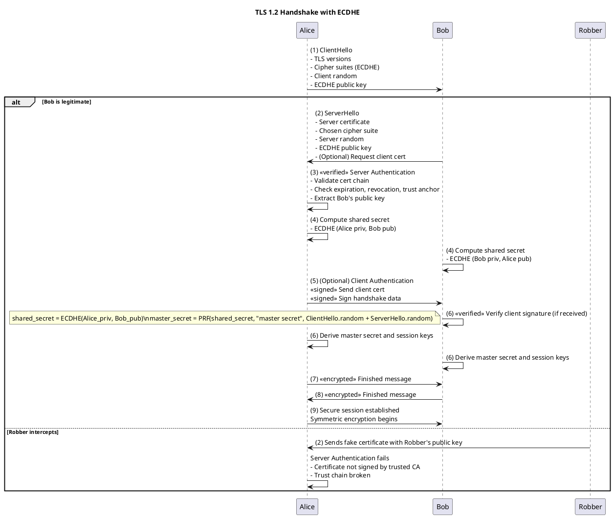
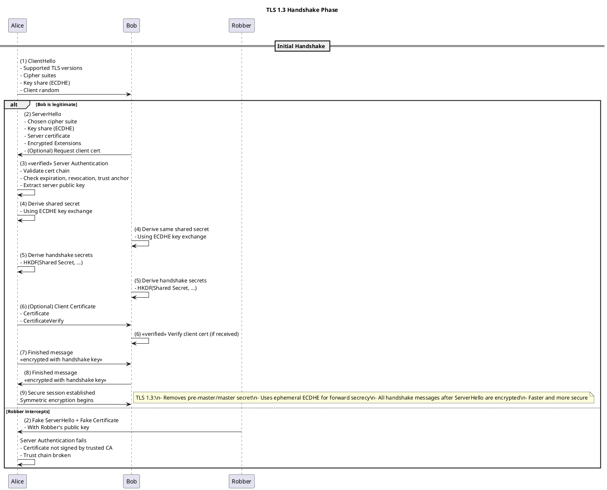

# TLS explained to myself

## Basic crypto concept

[For the reamaining of this article. Alice is message sender, Bob is the receiver](https://fr.wikipedia.org/wiki/Alice_et_Bob).

### Symetric cryptography

We use same key to encode and decode.

### Asymetric cryptography: we generate two keys, key1 and key2.

When we encode with key 1 we can decode with key 2  and vice versa.
One key is in general private, and other one is public.

Thus definition given [here](https://youtu.be/T4Df5_cojAs?t=128)

2 usages:

1. **Key encryption**: Any message encrypted with Bob's public key can only be decrypted with Bob's private key.
In that case Recipient (Bob) give public key to sender (Alice). 
Sender (Alice) use recipient (Bob) public key to encode message, recipient (Bob) use its private key to decode the message.

2. **Digital Signatures**: Anyone with access to Alice's public key can verify that a message 
could only have been created by someone with access to Alice's private key. (it was encrypted using private key here)

In that case Alice encrypt message using her private key. Bob check tries to decode (digital signature) using Alice public key. 
If he can decode, it proves Alice had encrypted this message.
We will see that this is what a CA does to digitally sign a certificate.

I had read:
It makes no sense to encrypt anything with your private key, 
because the message could then be decrypted by the public key that everybody has access to. 
When somebody wants to send you a secret message, they encrypt it using your public key, and then only you can decrypt it, 
because only you know your private key
-> not the case for signature

**Key encryption** and **digital signatures** are well in 2 related section of this doc:
https://docs.oracle.com/cd/E19424-01/820-4811/6ng8i26ba/index.html

The pub/priv keys are related :

Quoting : https://docs.neo.org/docs/en-us/basic/concept/cryptography/encryption_algorithm.html

> Elliptic Curve Cryptography (ECC) algorithm is a kind of asymmetric encryption algorithm. With the irreversible feature of K=k*G process (K: public key, G: base point (constant)), it can prevent solving private key from public key by brutal force.

See also Mastering bitcoin book.

## Certificates

### See intro to certificate

Oracle doc: https://docs.oracle.com/cd/E19424-01/820-4811/6ng8i26ao/index.html

### Note cert can be used for 

- client authentification: signature
- Mail encryption (S/MIME certificate): encryption
- SSL/TLS (client and server SSL certificate): certifcates are signed and enables encryption keys exchange
- Signature of software delivery (object signing certifcate): signature
- Identify CA (CA certificates): signature


### Every X.509 certificate consists of the following sections.

- A data section, including the following information.
    - d1: The version number of the X.509 standard supported by the certificate.
    - d2: The certificate’s serial number. Every certificate issued by a CA has a serial number that is unique among the certificates issued by that CA.
    - d3: **Information about the user’s public key, including the algorithm used and a representation of the key itself.**
    - d4: **The DN of the CA that issued the certificate.**
    - d5: **The period during which the certificate is valid** (for example, between 1:00 p.m. on November 15, 2003 and 1:00 p.m. November 15, 2004).
    - d6: **The DN of the certificate subject** (for example, in a client SSL certificate this would be the user’s DN), also called the subject name.
    See also SAN: https://en.wikipedia.org/wiki/Subject_Alternative_Name and https://support.dnsimple.com/articles/what-is-common-name/#common-name-vs-subject-alternative-name. See [multidomain certificate](./multidomain-appendix.md).
    - d7: Optional certificate extensions, which may provide additional data used by the client or server. For example, the certificate type extension indicates the type of certificate—that is, whether it is a client SSL certificate, a server SSL certificate, a certificate for signing email, and so on. Certificate extensions can also be used for a variety of other purposes.

- A signature section, includes the following information.
    - s1: The cryptographic algorithm, or cipher, used by the issuing CA to create its own digital signature.
    - s2: **The CA’s digital signature, obtained by hashing all of the data in the certificate together and encrypting it with the CA's private key.**


### More details on sections and certificate hierarchy


See https://en.wikipedia.org/wiki/Root_certificate#/media/File:Chain_Of_Trust.svg


The root CA will be used to sign lower hierarchy certificate.
Lower hierarchy certificate will contain:
- A DN (distinguished name) [(d6)](../tls-certificate.md#every-x509-certificate-consists-of-the-following-sections)
- public key of the certificate itself [(d3)](../tls-certificate.md#every-x509-certificate-consists-of-the-following-sections) 
- reference DN of the issuer: root CA (or subordinate CA), or upper certificate in the chain)  [(d4)](../tls-certificate.md#every-x509-certificate-consists-of-the-following-sections)
<!-- wikipedia has owner and issuer but both are issuer -->
- contain digital signature of the root CA (signed with CA private key), subordinate CA (signed with subordinate CA private key) or previous certificate in the chain (signed with previous certificate private key) [(s1, s2)](../tls-certificate.md#every-x509-certificate-consists-of-the-following-sections).


Root CA will contain
- CA name [(d6)](../tls-certificate.md#every-x509-certificate-consists-of-the-following-sections)
- Root CA public key key [(d3)](../tls-certificate.md#every-x509-certificate-consists-of-the-following-sections), matching root CA private key
- reference DN of issuer: itself [(d4)](../tls-certificate.md#every-x509-certificate-consists-of-the-following-sections)
- contain Root CA signature signed with root CA private key -- **Self-signed** --

**So a root CA is always a [Self-Signed Certificate?](../tls-certificate.md#self-signed-certificate). ** 

### chain certificate and certificate verification 

Quoting Oracle doc on certificate:
https://docs.oracle.com/cd/E19424-01/820-4811/6ng8i26ao/index.html
Here is how certificate and chain of certificate are verified


> A certificate chain traces a path of certificates from a branch in the hierarchy to the root of the hierarchy. In a certificate chain, the following occur:
> Each certificate is followed by the certificate of its issuer.
>  In Figure 5–4, the Engineering CA certificate contains the DN of the CA (that is, USA CA), that issued that certificate. USA CA’s DN is also the subject name of the next certificate in the chain.
>  Each certificate is signed with the private key of its issuer. The signature can be verified with the public key in the issuer’s certificate, which is the next certificate in the chain.


> Verifying a Certificate Chain

> Certificate chain verification is the process of making sure a given certificate chain is well-formed, valid, properly signed, and trustworthy. Directory Server software uses the following steps to form and verify a certificate chain, starting with the certificate being presented for authentication:

> 1. The certificate validity period is checked against the current time provided by the verifier’s system clock. (d5)
> 2. The issuer’s certificate is located (d4). The source can be either the verifier’s local certificate database (on that client or server) or the certificate chain provided by the subject (for example, over an SSL connection).
> 3. The certificate signature is verified using the public key in the issuer certificate.(verify s2 by using d3 in the next certificate in the chain )
> If the issuer’s certificate is trusted by the verifier in the verifier’s certificate database, verification stops successfully here. Otherwise, the issuer’s certificate is checked to make sure it contains the appropriate subordinate CA indication in the Directory Server certificate type extension, and chain verification returns to step 1 to start again, but with this new certificate.

### Server Authentication During SSL Handshake

Quoting Oracle Doc on SSL those steps are added for SSL certificate.
As depicted here: https://docs.oracle.com/cd/E19424-01/820-4811/6ng8i26ba/index.html (Server Authentication During SSL Handshake)

> 4. Does the domain name in the server’s certificate match the domain name of the server itself?
> This step confirms that the server is actually located at the same network address specified by the domain name in the server certificate. Although step 4 is not technically part of the SSL protocol, it provides the only protection against a form of security attack known as man-in-the-middle. Clients must perform this step and must refuse to authenticate the server or establish a connection if the domain names don’t match. If the server’s actual domain name matches the domain name in the server certificate, the client goes on to the next step.
> 5. The server is authenticated.
The client proceeds with the SSL handshake. If the client doesn’t get to step 5 for any reason, the server identified by the certificate cannot be authenticated, and the user is warned of the problem and informed that an encrypted and authenticated connection cannot be established. 

During SSL (RSA) handshake we will see below that server private key (matching public key contained in server certificate) is used by server to decode pre-master secret generated by the client once certificate is approved.

> If the server requires client authentication, the server performs the steps described in Client Authentication During SSL Handshake.

### Private CA

**CA are usually public and trusted by browser (Comdo, Verisign).
But some oganisations creates private CA, in that case we need to add to the trust the private CA (or intermediate <> subordinate CA), or actually any certificate in the chain).** To not confuse with server exception.

### Client Authentication During SSL Handshake

From:https://docs.oracle.com/cd/E19424-01/820-4811/6ng8i26ba/index.html (Client Authentication During SSL Handshake)

> SSL-enabled servers can be configured to require client authentication, or cryptographic validation by the server of the client’s identity.

Certificate validation process is similar to server authentification.
But we can add 2 steps (not part of SSL protocol) for that cases between step 4 and 5.

> 5'. Is the user’s certificate listed in the LDAP entry for the user?

> This optional step provides one way for a system administrator to revoke a user’s certificate even if it passes the tests in all the other steps. The Certificate Management System can automatically remove a revoked certificate from the user’s entry in the LDAP directory. All servers that are set up to perform this step then refuses to authenticate that certificate or establish a connection. If the user’s certificate in the directory is identical to the user’s certificate presented in the SSL handshake, the server goes on to the next step.

> 5''. Is the authenticated client authorized to access the requested resources?

> The server checks what resources the client is permitted to access according to the server’s access control lists (ACLs) and establishes a connection with appropriate access. If the server doesn’t get to step 6 for any reason, the user identified by the certificate cannot be authenticated, and the user is not allowed to access any server resources that require authentication.

Note that (I assume it is after cert validation)

> - When a server configured this way requests client authentication separate piece of digitally signed data to authenticate itself. The server uses the digitally signed data to validate the public key (refer to **note**) in the certificate and to authenticate the identity the certificate claims to represent.
> - The SSL protocol requires the client to create a digital signature by creating a one-way hash from data generated randomly during the handshake and known only to the client and server. The hash of the data is then encrypted with the private key that corresponds to the public key in the certificate being presented to the server.

(**note**): validate client has the private key matching public key

## Application to TLS

Alice (client) -> Bob (server)

### Symetic and asymetric

#### Symetric cryptography is not sufficient because an attacker could steal chiffer key. This key is exchanged between Alice and Bob.

````
@startuml
title Symetric cryptography

Alice->Bob: exchange key in clear
Alice -> Robber: steal the key
Alice -> Alice : encode message with the key
Alice -> Bob : send message to  bob
Alice -> Robber : steal message 
Robber -> Robber : decode the message
Bob -> Bob : decode message with key
@enduml
````


#### This why asymetric is used.

- Bob sends public key to Alice,
- Alice encrypts message with Bob's public key,
- Bob decrypts message with its private key.

````
@startuml
title ASymetric cryptography

Alice -> Bob : initiate authent
Bob -> Alice : send BOB public key
Alice -> Alice : encode message with BOB public key
Alice -> Bob : send message to  bob
Bob -> Bob : decode message with BOB private key
@enduml
````

Using asymmetric cryptography (public key crypto) has an higher cost than symmetric.
This is the reason why, they use a session key, Alice and Bob exchange this session key in asymmetric way,
and then continue to exchange and continue using this session key with symmetric cryptography.

### Man in the middle attach and need of a CA

**Problem**: The public key can be intercepted and substituted (man in the middle attach)
- Robber intercepts Bob's  public key and replace by Robber key.
- Alice encrypts the message using robber key (believing it is the one of Bob).
- She sends it back to robber (thinking it is bob). 
- Robber decodes Alice message. 
- He reencodes it using Bob's public key (to not arouse suspicions) 
- and send it to bob.

````
@startuml
title ASymetric cryptography and man in the middle attack

actor Alice 
actor Robber 
actor Bob

Alice -> Bob : initiate authent
Bob -> Robber : send BOB public key to Alice but stolen by Robber
Robber -> Robber : save BOB pulic key
Robber -> Alice : Send ROBBER public key instead of bob public key
Alice -> Alice : encode message with ROBBER public key (believing it is the one of Bob)
Alice -> Robber : send message to Robber (believing it is  Bob)
Robber -> Robber: decode message using ROOBER private key. He is happy
Robber -> Robber: encode message using BOB public key (to not make Bob suspicious)
Robber -> Bob: send message to bob
Bob -> Bob : decode message with key wiht BOB private key
@enduml
````

**Solution**: Certificate Authority (CA)

This matches that documentation (and many others): https://docs.oracle.com/cd/E19424-01/820-4811/6ng8i26ba/index.html (Messages Exchanged During SSL Handshake) and https://www.youtube.com/watch?v=7W7WPMX7arI.


````plantuml
@startuml
title Asymmetric Cryptography, TLS Handshake, and Certificate Authority Trust Model

actor Alice 
actor Robber 
actor Bob
actor CA

legend left
| Symbol         | Meaning                                |
|----------------|----------------------------------------|
| <<signed>>     | Digital signature                      |
| <<encrypted>>  | Encrypted with public key              |
| <<verified>>   | Validation step                        |
end legend

== Certificate Issuance Phase ==

Bob -> Bob: (A1) Generate asymmetric key pair\n(private (privkey.pem)/public key)
Bob -> Bob: (A2) Create Certificate Signing Request (CSR)\nIncludes public key, CN, SAN
Bob -> Bob: (A3) <<signed>> Sign CSR with Bob's private key\n(Proves possession of private key)
Bob -> CA  : (A4) Submit CSR + payment to CA
CA  -> CA  : (A5) <<verified>> Validate CSR\n- Verify CSR signature\n- Validate domain ownership (DCV via HTTP-01, DNS-01, TLS-ALPN-01...)
CA  -> CA  : (A6) <<signed>> Issue certificate\nSigned with CA's private key
CA  -> Bob : (A7) Return signed certificate (e.g., fullchain.pem)

note right
CA only delivers signed certificate with private key. No private key is delivered. CA's and Bob's private key are not shared. Certificate contains only Bob's public key. Certificate public key is known by clients.
Clients verify Bob's certificate using the CA's public key\nstored in their trusted root store (we can add private CA here)\nIntermediate certificates may be included. See "chain certificate and certificate verification"\nRevocation via OCSP or CRL.

end note

== TLS Handshake Phase ==

Alice -> Bob : (1) ClientHello\n- TLS versions\n- Cipher suites\n- Client random

alt Bob is legitimate
    Bob -> Alice : (2) ServerHello\n- Server certificate\n- Chosen cipher suite\n- Server random\n- (Optional) Request client cert
    Alice -> Alice : (3) <<verified>> Server Authentication\n- Validate cert chain (see "chain certificate and certificate verification")\n- Check expiration, revocation, trust anchor\n- Extract Bob's public key
    Alice -> Alice : (4) Generate pre-master secret\n<<encrypted>> Encrypt with Bob's public key
    Alice -> Bob   : (4) Send encrypted pre-master secret
    Alice -> Bob   : (5) (Optional) Client Authentication\n<<signed>> Send client cert\n<<signed>> Sign handshake data
    Bob -> Bob     : (6) <<verified>> Verify client signature (if received)
    Bob -> Bob     : (6) <<encrypted>> Decrypt pre-master secret
    Alice -> Alice : (6) Derive master secret
    note left    
    master_secret = PRF(pre_master_secret, "master secret", ClientHello.random + ServerHello.random)
    end note
    Bob -> Bob     : (6) Derive same master secret
    Bob -> Bob     : (7) Derive session keys
    Alice -> Alice : (7) Derive same session keys
    Alice -> Bob   : (8) <<encrypted>> Finished message
    Bob -> Alice   : (9) <<encrypted>> Finished message
    Alice -> Bob   : (10) Secure session established\nSymmetric encryption begins

    note right
    In TLS 1.3:\n- Simplified handshake\n- Ephemeral key exchange (ECDHE) in clientHello and ServerHello\n- No pre-master/master secret distinction\nInstead, a shared secret is derived directly from the ephemeral key exchange (ECDHE).\n- Forward secrecy (no need additional diagram but copilot can do)
    end note
else Robber intercepts
    Robber -> Alice: (2) Sends fake certificate with Robber's public key
    Alice -> Alice : Server Authentication fails\n- Certificate not signed by trusted CA\n- Trust chain broken
end

@enduml
````
<!--Tanenbaum p913, figure is similar clear stop, note server can send a chain of certificate when not known, it is RSA as in this diagram -->

See actual application here: https://github.com/scoulomb/myDNS/blob/master/2-advanced-bind/5-real-own-dns-application/6-use-linux-nameserver-part-h.md


This is known as RSA handshake diagram is aligned with explanation given here:
https://www.cloudflare.com/learning/ssl/what-happens-in-a-tls-handshake. (I mirrored the page [cloudfare-doc.md](cloudfare-doc.md)).


### TLS handshake Key-exchange mechanism

````chatinput
Compare the support timeline of three key exchange mechanisms used in the TLS handshake:

- RSA (as shown in my [schema under “man-in-the-middle attack and need of a CA”](#man-in-the-middle-attach-and-need-of-a-ca))
- Diffie-Hellman (DH)
- Elliptic Curve Diffie-Hellman Ephemeral (ECDHE)
For each mechanism, specify:

- Which TLS versions support it (TLS 1.0, 1.1, 1.2, 1.3)
- Whether it was originally supported or added later via an RFC
- If and when it was deprecated or removed
- Additionally, highlight which mechanisms rely on:
  - A shared secret directly derived from the key exchange 
  - A pre-master/master secret model
  
export this to markdown format it will be under section "### Key-exchange mechanism " in my doc
````


This section compares the support timeline and characteristics of three key exchange mechanisms used in the TLS handshake: **RSA**, **Diffie-Hellman (DH)**, and **Elliptic Curve Diffie-Hellman Ephemeral (ECDHE)**.

#### 🔐 RSA (Key Transport)
- **TLS Versions**: Supported in TLS 1.0, 1.1, 1.2. **Removed in TLS 1.3**.
- **Introduction**: Originally supported in TLS 1.0 (RFC 2246, 1999).
- **Deprecation**: Deprecated and removed in TLS 1.3 (RFC 8446, 2018).
- **Secret Derivation**: Uses a *pre-master secret* generated by the client and encrypted with the server’s RSA public key.
- **Forward Secrecy**: ❌ No — compromise of the server’s private key compromises past sessions.

#### 🔁 Diffie-Hellman (DH)
- **TLS Versions**: Supported in TLS 1.0, 1.1, 1.2. **Removed in TLS 1.3**.
- **Introduction**: Originally supported in TLS 1.0 (RFC 2246, 1999).
- **Deprecation**: Static DH is discouraged; fully removed in TLS 1.3.
- **Secret Derivation**: Derives a *shared secret* directly from the DH key exchange.
- **Forward Secrecy**: ✅ Yes, but only with ephemeral DH (DHE).

#### 🧮 Elliptic Curve Diffie-Hellman Ephemeral (ECDHE)
- **TLS Versions**: Supported in TLS 1.2 and TLS 1.3. Not present in TLS 1.0 or 1.1.
- **Introduction**: Added via RFC 4492 (2006) for TLS 1.2. Mandatory in TLS 1.3 (RFC 8446).
- **Deprecation**: Not deprecated — **preferred** in TLS 1.3.
- **Secret Derivation**: Derives a *shared secret* from the ephemeral EC key exchange.
- **Forward Secrecy**: ✅ Yes — ephemeral keys ensure forward secrecy.

#### 🔍 Summary Table

| Mechanism | TLS Versions | Introduced via | Deprecated/Removed | Secret Model                                                                                                                                                                             | Forward Secrecy |
|-----------|--------------|----------------|---------------------|------------------------------------------------------------------------------------------------------------------------------------------------------------------------------------------|------------------|
| RSA       | 1.0–1.2      | RFC 2246       | Removed in TLS 1.3  | Pre-master secret                                                                                                                                                                        | ❌ No             |
| DH        | 1.0–1.2      | RFC 2246       | Removed in TLS 1.3  | Pre-master secret                                                                                                                                                                        | ✅ (if ephemeral) |
| ECDHE     | 1.2–1.3      | RFC 4492       | —                   | Pre-master secret  (TLS 1.2 ECDHE handshake [So WITHOUT HDKF as 1.2] WITH pre-master secet) XOR Shared secret  (TLS 1.3 ECDHE handshake [So WITH HDKF as 1.3] without pre-master secret) | ✅ Yes            |


I patched the secret model from initial generation!!!

### Pre-master and master secret?

- RSA, DH use pre-master secret
- ECDHE use depending on version


````chatinput
Does ECDHE use pre-master secret?
````


#### ECDHE in TLS 1.2 vs TLS 1.3

##### 🔐 ECDHE in TLS 1.2

- **Purpose**: Provides forward secrecy using keys.
- **Usage**: Part of the cipher suite (e.g., `TLS_ECDHE_RSA_WITH_AES_128_GCM_SHA256`).
- **Handshake Flow**:
  1. Client and server negotiate cipher suite.
  2. Server sends certificate and ECDHE public key.
  3. Client responds with its ECDHE public key.
  4. Both compute a **shared secret** via ECDHE.
  5. This shared secret is called the **pre-master secret**.
  6. The pre-master secret is used to derive the **master secret**.
- **Authentication**: Via certificates (e.g., RSA or ECDSA).
- **Flexibility**: Supports RSA, DHE, ECDHE, etc.

##### 🔐 ECDHE in TLS 1.3

- **Purpose**: Still provides forward secrecy — now **mandatory**.
- **Usage**: Cipher suites no longer include key exchange methods.
- **Handshake Flow**:
  1. Client sends ECDHE public key in `ClientHello`.
  2. Server responds with its ECDHE public key in `ServerHello`.
  3. Both compute a **shared secret**.
  4. This secret is used in a structured **HKDF-based key schedule**.
- **Terminology**: No "pre-master secret" — just **(EC)DHE shared secret**.
- **Security**: Stronger defaults, simplified design.

##### ✅ Summary Table

| Feature               | TLS 1.2                          | TLS 1.3                          |
|----------------------|----------------------------------|----------------------------------|
| ECDHE usage          | Optional, part of cipher suite   | Mandatory, always used          |
| Cipher suite         | Includes key exchange method     | Only includes symmetric ciphers |
| Pre-master secret    | Explicitly used                  | Replaced by HKDF input          |
| Key derivation       | Custom PRF                       | HKDF                            |
| Forward secrecy      | Optional                         | Always enforced                 |


### MY Conclusion 

- My UML [schema under “man-in-the-middle attack and need of a CA”](#man-in-the-middle-attach-and-need-of-a-ca)) shows TLS 1.2 handshake using RSA key exchange. 
- it is also the same as TLS 1.0 and 1.1 with RSA.
- TLS 1.2 handshake using ECDHE key exchange is without HDKF
- TLS 1.3 enforce ECDHE with HDKF (no pre-master secret as we have HDKF)

See also

- https://www.encryptionconsulting.com/diffie-hellman-key-exchange-vs-rsa/
- https://en.wikipedia.org/wiki/Diffie%E2%80%93Hellman_key_exchange
-  - This pictures illustrates the shared secret with  TLS 1.3 where we use ECDHE with HDKF

- In TLS 1.3 client will use server certificate public key to verify a signature provided by server (as for client certificate in RSA handhake) but will not send to server a pre-master key . 


### TLS 1.2 ECDHE handshake [So WITHOUT HDKF as 1.2] WITH pre-master key

https://tls12.xargs.org/#client-encryption-keys-calculation

#### UML

> Adapt UML with TLS 1.2 RSA handshake to TLS 1.2 ECDHE handshake [So without HDKF]



Step 6 is client/server encryption key calculation @https://tls12.xargs.org/#client-encryption-keys-calculation


#### ✅ Key Differences

| Feature                  | TLS 1.2 with RSA            | TLS 1.2 with ECDHE         |
|--------------------------|-----------------------------|-----------------------------|
| **Key Exchange Method**  | Static RSA encryption       | Ephemeral Diffie-Hellman (ECDHE) |
| **Forward Secrecy**      | ❌ No                        | ✅ Yes                       |
| **Shared Secret**        | Sent encrypted by client    | Derived via key exchange    |
| **Server Private Key Risk** | High (past sessions exposed) | Low (past sessions safe)    |
| **Performance**          | Faster                      | Slightly slower             |
| **Security Level**       | Lower (if key compromised)  | Higher (even if key compromised) |
| **Common Use Today**     | Deprecated                  | Preferred                   |


#### 🔄 How They Work

##### 🔸 TLS 1.2 with RSA
- Client generates a **pre-master secret**.
- Encrypts it with the **server’s RSA public key**.
- Server decrypts it using its **private key**.
- Both derive the **master secret** and session keys.

##### 🔸 TLS 1.2 with ECDHE
- Client and server exchange **ephemeral public keys**.
- Each computes a **shared secret** using their private key and the other’s public key.
- Both derive the **master secret** and session keys.
- Provides **forward secrecy** — past sessions remain secure even if keys are compromised.


#### Pre-Master secret and master secret (TLS 1.2 ECDHE handshake [So without HDKF as 1.2] with pre-master)

From https://tls12.xargs.org/#server-encryption-keys-calculation

The client multiplies the server's public key by the client's private key using the curve25519() algorithm. The 32-byte result is called the PreMasterSecret.

The client then calculates 48 bytes of the MasterSecret from the PreMasterSecret using the following method:

````
seed = "master secret (here a string)" + client_random + server_random
a0 = seed
a1 = HMAC-SHA256(key=PreMasterSecret, data=a0)
a2 = HMAC-SHA256(key=PreMasterSecret, data=a1)
p1 = HMAC-SHA256(key=PreMasterSecret, data=a1 + seed)
p2 = HMAC-SHA256(key=PreMasterSecret, data=a2 + seed)
MasterSecret = p1[all 32 bytes] + p2[first 16 bytes]
````

same as

```
master_secret = PRF(pre_master_secret,
            "master secret",
             ClientHello.random +
             ServerHello.random) [0..47];
where seed => PRF
```

The server multiplies the client's public key by the server's private key using the curve25519() algorithm. The 32-byte result is called the PreMasterSecret.
This is identical to the PreMasterSecret found by the client, therefore the following calculations are identical. 


So master secret derived from pre-master secret.


Once we have master secret we compute encryption key

````
seed = "key expansion" + server_random + client_random
a0 = seed
a1 = HMAC-SHA256(key=MasterSecret, data=a0)
a2 = HMAC-SHA256(key=MasterSecret, data=a1)
a3 = HMAC-SHA256(key=MasterSecret, data=a2)
a4 = ...
p1 = HMAC-SHA256(key=MasterSecret, data=a1 + seed)
p2 = HMAC-SHA256(key=MasterSecret, data=a2 + seed)
p3 = HMAC-SHA256(key=MasterSecret, data=a3 + seed)
p4 = ...
p = p1 + p2 + p3 + p4 ...
client write mac key = [first 20 bytes of p]
server write mac key = [next 20 bytes of p]
client write key = [next 16 bytes of p]
server write key = [next 16 bytes of p]
client write IV = [next 16 bytes of p]
server write IV = [next 16 bytes of p]
````

Those are used for symetric encryption,

We use: https://en.wikipedia.org/wiki/Elliptic-curve_Diffie%E2%80%93Hellman to reach same secret (Client MasterSecret == Server MasterSecret)

From https://crypto.stackexchange.com/questions/1139/what-is-the-purpose-of-four-different-secrets-shared-by-client-and-server-in-ssl
> The encryption part requires a key (and an IV for symmetric encryption algorithms which use CBC mode, and this is subject to a few subtleties which depend on the SSL protocol version, so I will not detail these here). The MAC also needs a key. Using the same key for two distinct algorithms is, as a general rule, not recommended at all: there may be unwanted interactions between the two algorithms, an improbable but not impossible event which has not been thoroughly studied. So, to be on the safe side, we generated two keys, one for encryption and one for the MAC. The two keys come from the master secret, but the derivation mechanism is like a hash function, so it supposedly makes it impossible to guess the MAC key even if you know the encryption key, and vice versa. Since TLS has a key derivation function (the "PRF") which can produce outputs of arbitrary length...

See Tanenbaum p915 (figure 8.51), for the MAC usage when transmitting data with SSL. We can see message is fragmented into blocks, block is compressed, MAC is added and then block is chiffred, and a header is added. MAC guarantees data integrity.

<!-- see also: https://stackoverflow.com/questions/31009358/tls-mac-message-verification -->

### Adapted plantuml with TLS 1.3 ECDHE handshake [So WITH HDKF as 1.3] without pre-master)

#### UML



Step 4 and 5 are client/server application key calc @https://tls13.xargs.org/#client-application-keys-calc


#### 🔐 TLS 1.2 ECDHE vs TLS 1.3 Handshake

##### ✅ Comparison Table

| Feature                         | **TLS 1.2 with ECDHE**                                  | **TLS 1.3**                                                  |
|----------------------------------|----------------------------------------------------------|--------------------------------------------------------------|
| **Handshake Messages**          | Multiple steps: ClientHello, ServerHello, Certificate, ServerKeyExchange, etc. | Simplified: fewer round trips, fewer messages                |
| **Key Exchange**                | ECDHE (ephemeral keys exchanged in separate message)     | ECDHE (keys included directly in ClientHello and ServerHello) |
| **Forward Secrecy**             | ✅ Yes                                                   | ✅ Yes                                                       |
| **Pre-Master / Master Secret**  | Uses pre-master → master secret → session keys           | No pre-master/master secret; uses HKDF to derive secrets     |
| **Session Resumption**          | Session IDs or session tickets                           | 0-RTT (optional), PSK-based resumption                       |
| **Encryption Start**            | After Finished messages                                  | Earlier: after ServerHello (encrypted handshake)             |
| **Security Improvements**       | Vulnerable to downgrade attacks if not configured well   | Removes legacy features (RSA key exchange, static DH, etc.)  |
| **Performance**                 | Slower (2 round trips)                                   | Faster (1 round trip)                                        |
| **Client Authentication**       | Optional, via CertificateRequest                         | Still supported, but more streamlined                        |

---

##### 🔄 Key Improvements in TLS 1.3

- 🧹 **Simplified handshake**: fewer messages, faster setup.
- 🔐 **Stronger security**: removes outdated algorithms (e.g., RSA key exchange).
- ⚡ **Faster performance**: 1-RTT handshake, optional 0-RTT for resumed sessions.
- 🔄 **Forward secrecy by default**: always uses ephemeral key exchange.


### Summary of protocol

This what is shown here 
TLS 1.2 ECDHE handshake [So WITHOUT HDKF as 1.2] WITH pre-master key: https://tls12.xargs.org/#client-encryption-keys-calculation
TLS 1.3 ECDHE handshake [So WITH HDKF as 1.3] without pre-master key: https://tls13.xargs.org/#client-application-keys-calc

See https://tls.ulfheim.net/ and https://github.com/scoulomb/illustrated-tls.


### SSL in short 

SSL/TLS establishes a secured connexion between 2 sockets ensuring
- Parameter negotiation between client and server
- Authentification of server by client (and vice versa in mTLS) (certificate, [signature](./in-learning-complement/learning-ssl-tld.md#digital-signature)) 
- Secret of communication (encrpyption key)
- protection of data integrity (MAC). See [MD5 and MAC key](./bitcoin-appendix.md#note)

Search for handshake, signature, encrypt, integrity in sequence diagram!

<!-- https://www.ibm.com/docs/en/ibm-mq/7.5?topic=ssl-how-tls-provide-authentication-confidentiality-integrity -->

SSL has two sub-protocol to
- Establih a secure connexion
- Use secure  connection

SSL is over TCP.

Ref. Tanenbaum p915

## Link with http over socket

When we implemented our own http client here: https://github.com/scoulomb/http-over-socket/blob/main/main.py
This part (tls handshake):

````python
https_context.wrap_socket(raw_socket, server_hostname=connection.hostname)
````

matches this part of the flow explained here!


## Mutual auth (mTLS)

When not done Alice has the guarantee she talks to Bob, but not vice-versa/
Bob does not have the gurantee he is talking to Alice.

## self-signed certificate 

From [Wikipedia](https://en.wikipedia.org/wiki/Self-signed_certificate): In cryptography and computer security, a self-signed certificate is a certificate that is not signed by a certificate authority (CA).

Also quoting: https://www.keyfactor.com/blog/self-signed-certificate-risks/
> Another strategy is to issue self-signed SSL certificates. A self-signed certificate is one that is not signed by a CA at all – neither private nor public. In this case, the certificate is signed with its own private key, instead of requesting it from a public or a private CA.

Some CA like let's encrypt are free.

See https://github.com/scoulomb/home-assistant/blob/main/2025-new-gen-setup/external-access/cert-terminology/self-signed-vs-private-ca-vs-public-ca.md

## Multidomain appendix

See [appendix](./multidomain-appendix.md).

## Links

- https://medium.com/sitewards/the-magic-of-tls-x509-and-mutual-authentication-explained-b2162dec4401
- https://www.youtube.com/watch?v=7W7WPMX7arI
- https://www.youtube.com/watch?v=4nGrOpo0Cuc
- https://www.youtube.com/watch?v=T4Df5_cojAs

<!-- above ccl ok -->

## Complements 

- [see IN learning](./in-learning-complement/learning-ssl-tld.md).
<!-- well consitent with this page and good complement on top, no need to full read 1 shot -->
- [see SSH certificate](../lab-env/README.md#ssh-summary) we use key in cert for encrpytion and cert are signed.
<!--did not check in details if signature is used as in SSL during handshake, SSH review OK -->
- [See link with Bitcoin](./bitcoin-appendix.md)
<!-- ok conlduded BC -->
- F5 SSL offload and termination:
    - https://support.f5.com/csp/article/K65271370 (see [locally](./f5-doc/Most%20Common%20SSL%20Methods%20for%20LTM%20SSL%20Offload%2C%20SSL%20Pass-Through%20and%20Full%20SSL%20Proxy.html))
    - Similalry OpenShift has 
        - https://docs.openshift.com/container-platform/4.7/networking/routes/secured-routes.html
        > - Secure routes provide the ability to use several types of TLS termination to serve certificates to the client. The following sections describe how to create re-encrypt, edge, and passthrough routes with custom certificates.
        - See also
            - https://github.com/scoulomb/myDNS/blob/master/2-advanced-bind/5-real-own-dns-application/6-use-linux-nameserver-part-g.md
            - https://github.com/scoulomb/myDNS/blob/master/2-advanced-bind/5-real-own-dns-application/6-use-linux-nameserver-part-h.md#default-certificate

    <!-- 
    See links with 1a / links cloudif
    - https://github.com/scoulomb/private_script/blob/main/Links-mig-auto-cloud/README.md#notes-1
    - https://github.com/scoulomb/private_script/blob/main/Links-mig-auto-cloud/README.md#notes-2
    - https://github.com/scoulomb/private_script/blob/main/Links-mig-auto-cloud/README.md#notes-3
    -->
    <!-- http redirect on F5:https://clouddocs.f5.com/api/irules/HTTP__redirect.html similar to Apache 2 redirect as in https://github.com/open-denon-heos/remote-control -->
<!-- ok concluded Termination -->
<!-- Linkedin saved in NAS OK --- >
<!-- tanenabum OK and note added on MAC juge OK -->
- [Link wiht oauth](./oauth-appendix.md)
<!-- ccl ok -->
- [Ingress and certificate with compose](../replicate-k8s-ingress-locally-with-compose/README.md)

- See https://github.com/scoulomb/home-assistant/tree/main/2025-new-gen-setup/external-access/cert-terminology